# 项目背景

发现悉尼大学学生无法使用学校非本专业的课程资源，导致了学生选择选修课程时一头雾水:confused: ，复习与预习课程也十分困难:cry: 。受到MIT OpenCourseWare启发，对开源的在线教育平台项目进行二次开发，搭建了悉尼大学免费课程资源分享平台。

本网站适合以下同学：

-   一放假就迫不及待地预习下学期课程的卷王——可在本站把之后的专业课全部预习了，宁可累死自己，也要卷死同学！
-   选修课太多的同学——可在本站学习些入门课程，再决定要不要选修该课继续深入学习
-   想转专业的同学——可在本站上其他专业的课程，来确定自己是否真正适合那个专业
-   想培养兴趣爱好，陶冶情操的同学——本站提供丰富的、各个学科的课程，帮助同学德智体美全面发展

由于是个学习项目以及时间原因，仅开发了网站的核心功能，更多功能可能会在未来继续开发:smile:

# 项目简介

## 会员前台

为了优化SEO，使用Nuxt.js进行服务端渲染

### 注册登录

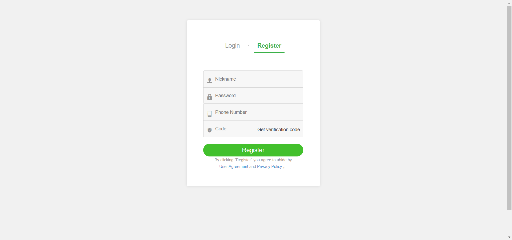

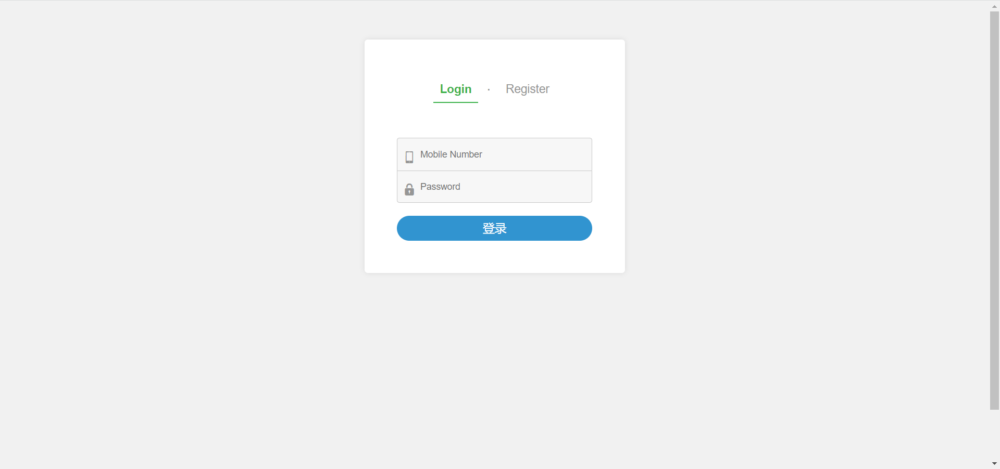

### 首页

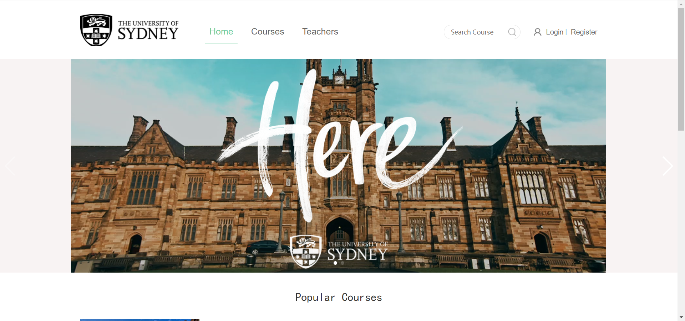

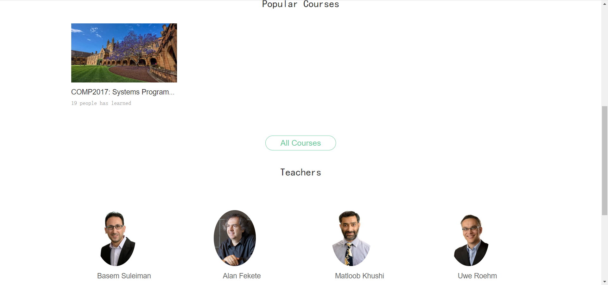

### 课程

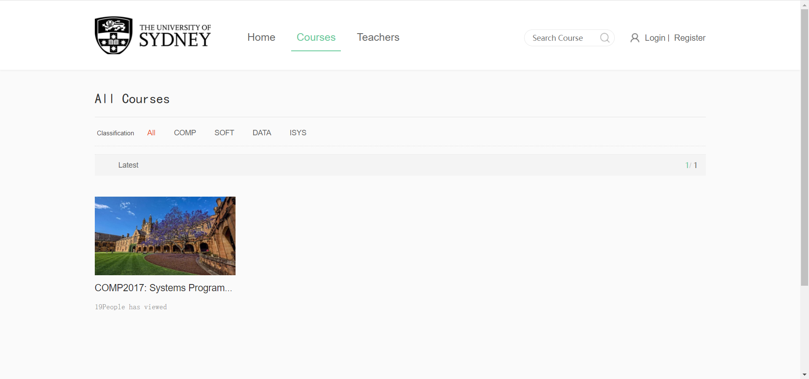
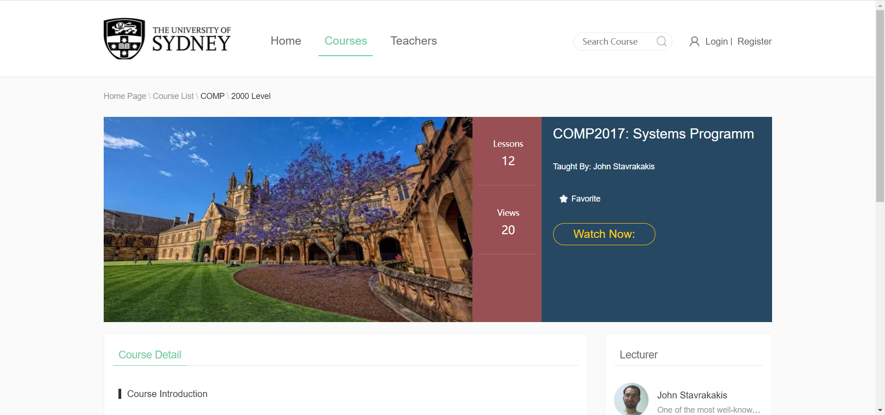

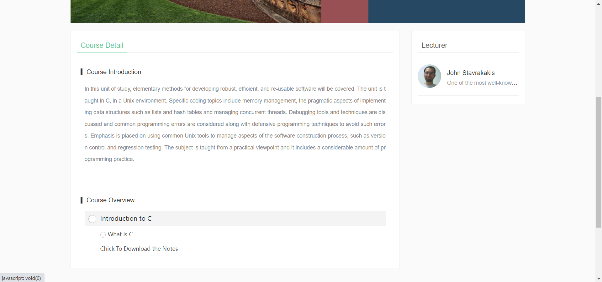

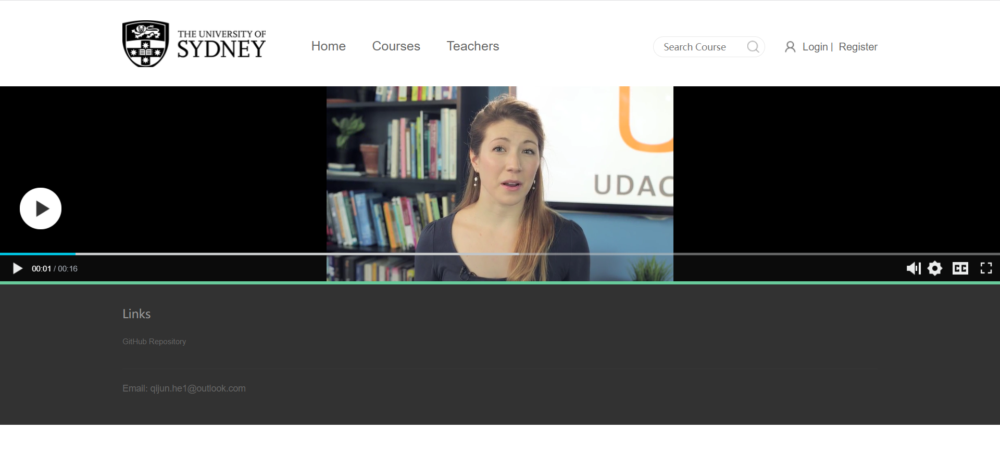

### 教师

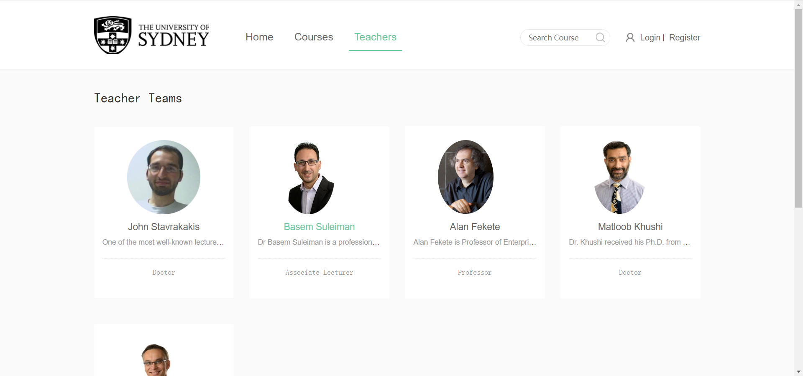

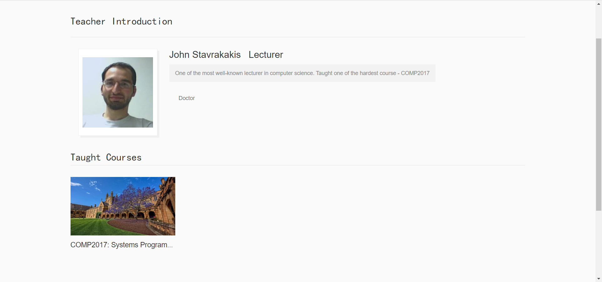

## 管理员后台 

使用主流的前端框架 Vue，使用 ES6 开发规范，采用模块化的开发模式，在vue-admin-template 模板上二次开发，使用 Element-ui 进行页面布局。使用 Npm 进行依赖管理， Webpack 进行静态资源的打包， axios 进行 Ajax 请求调用。

### 讲师管理

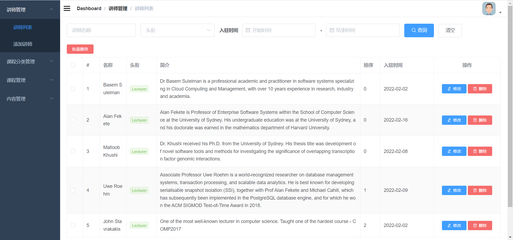

### 课程分类管理

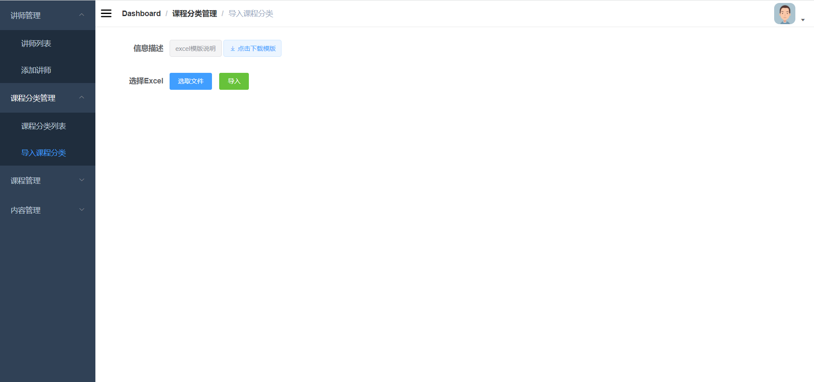

### 课程管理

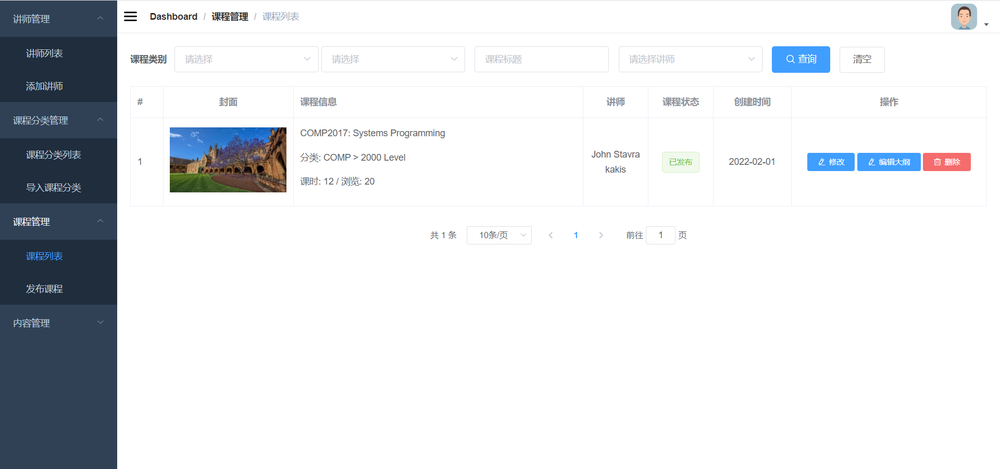

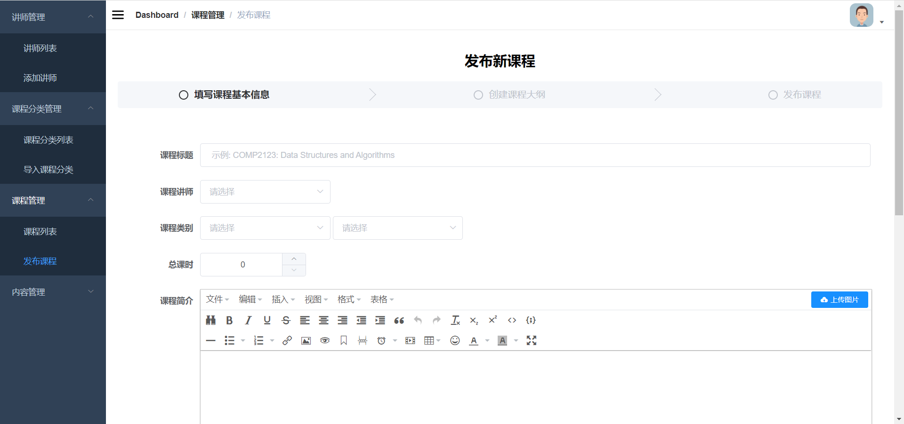

### 内容管理

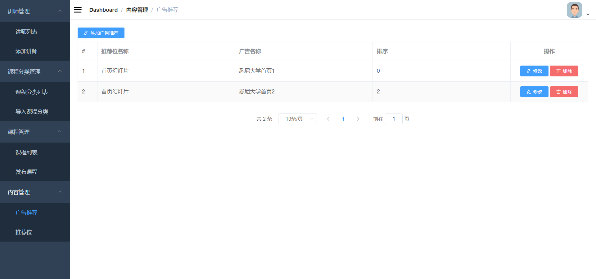

## 后端

使用市面上流行的 SpringBoot + SpringCloud 进行微服务架构，并按照业务逻辑拆分成多个微服务。使用Nacos注册中心与OpenFeign进行服务调用，同时使用Sentinel进行了服务容错。使用了Spring Gateway作为网关

使用了 OAuth2+JWT 实现了分布式的访问

采用了多元的数据存储技术——MySQL，Redis，云服务，并使用 MyBatis-Plus、RedisTemplate、阿里云SDK 进行持久层的操作

接口方面统一采用RESTful风格，并使用Swagger2进行描述

### 技术架构

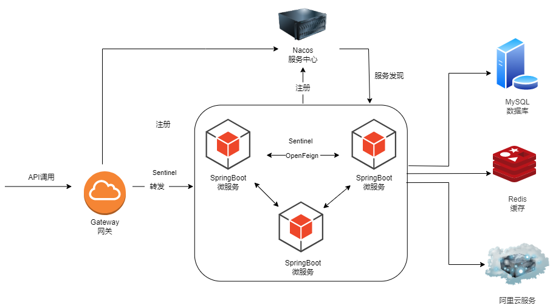

### 项目结构

>   usyd_ocw                 // 后端项目
>   ├── common                      // 通用代码层
>   │       └── common_util             // 工具类
>   │       └── service_base            // 业务通用代码
>   ├── api_gateway               // gateway网关
>   ├── feign-api              // 远程调用接口     
>   ├── service                     // 业务代码层
>   │       └── service_cms             // 前台内容api
>   │       └── service_edu             // 后台内容api
>   │       └── service_oss             // 阿里云oss文件存储
>   │       └── service_sms             // 阿里云短信分发
>   │       └── service_ucenter         // 用户模块
>   │       └── service_vod             // 腾讯云vod视频存储

